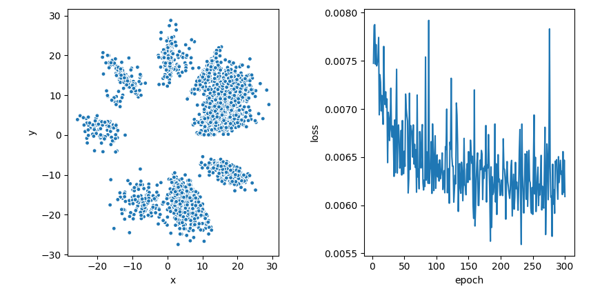

## Motivation

Autoencoders are used to create low-dimensional representations that compress as much information as possible from the original data; hopefully, the learned representation will be comprised of high-level features useful for any other statistical model that needs to handle the same data. What is fed to the autoencoder is the usual Cartesian representation, but if the data has some underlying structure, from disjoint clusters to some exotic lower-dimensional manifold, it might be easier to capture such structure if we work with angular features instead. In particular, encoding the angular features directly makes it straightforward to visualize the data in $\mathbb{R}^2$.

## Formulation

Assume we have data $x_1,...,x_n \in \mathbb{R}^d$; we want to project this data to $\mathbb{R}^2$ while preserving as much information as possible; if we look at their [polar representation](https://en.wikipedia.org/wiki/N-sphere#Spherical_coordinates)

$$
x_i = (r_i, \phi_i), \quad  r_i = \Vert x_i \Vert_2, \phi_i = (\phi_i, ..., \phi_{i,d-1})
$$
where the angular coordinates are constrained to

$$
\phi_{i,k} \in [0,\pi], \quad k=1,...,d-2\\
\phi_{i,d-1} \in [0,2\pi]
$$ 

we could use the original norms $\Vert x_i\Vert_2$ as the radial component in the projections, and what is left is mapping the original angular features to the interval $[0,2\pi]$; so, if we had a function $\Psi_{\theta_{1}}(\cdot)$ that maps the angular representation to this interval, it would be straightforward to map $x_i$ to the plane as $\left( \Vert x_i \Vert_2,\Psi_{\theta_{1}}(\phi_i) \right)$ in polar coordinates, or equivalently 

$$
\Vert x_i \Vert_2 \cdot (\cos (\Psi_{\theta_{1}}(\phi_i)), \sin (\Psi_{\theta_{1}}(\phi_i)))
$$ 

in Cartesian coordinates; since angle spaces are periodic, $\Psi_{\theta_{1}}$ would need to be periodic in the sense that $\Psi_{\theta_{1}}(y) \approx 0$ and $\Psi_{\theta_{1}}(z) \approx 2\pi$ only if $y \approx z$.

The reason why a high-quality projection with these characteristics must exist, even though it could seem too rigid at first, is because this is equivalent to finding a closed path on the hypersphere 

$$\mathbb{S}^{d-1} = \{x \in \mathbb{R}^{d}:\Vert x\Vert _2 = 1\}
$$ 

such that it follows closely the shape that our rescaled unit-norm data, 

$$
\mathcal{D} = \{z_i = x_i/\Vert x_i \Vert_2, i=1,...n\} \subset \mathbb{S}^{d-1}
$$

induces on $\mathbb{S}^{d-1}$. To see this, let $\Omega$ be the seth of continuous, closed paths on $\mathbb{S}^{d-1}$; since they are one-dimensional, they can be characterized as

$$
\Omega = \{f:[0,2\pi] \mapsto \mathbb{S}^{d-1}| f \in C^1, f(0) = f(2\pi)\}
$$ 

which is the set of all continuous, periodic functions from $[0,2\pi]$ to $\mathbb{S}^{d-1}$. It's not hard to see that there must be an element in $\Omega$ that goes through each point in $\mathcal{D}$, that is, there is $g \in \Omega$ such that $g(t_i) = x_i/ \Vert x_i \Vert_2$ for some $t_1,...t_n \in (0,2\pi)$, and conversely there should exist $g^{-1}$ such that $g{-1}(x_i/\Vert x_i\Vert _2) = t_i \in [0,2\pi], i=1,...,n$. This tells us that the kind of projection we are looking at is not too restrictive and in fact has arbitrary flexibility; however, we aim to find a closed path that captures only the general shape of $\mathcal{D}$, in this way giving us valuable information when projected onto $\mathbb{R}^2$.  

An autoencoder architecture can help us find such path. $\Psi_{\theta_1}$ would be the encoder section of the network, and we would also have a decoder  $\Phi_{\theta_2}$ such that $\Phi_{\theta_{2}}(\Psi_{\theta_{1}}(\phi_i)) \approx \phi_i, i=1,...,m$, with the additional restriction that $\Phi_{\theta_{2}}(0) = \Phi_{\theta_{2}}(2\pi)$. As usual, the loss function would be the squared reconstruction error, so for a minibatch $x_1,...,x_k$: 

$$
L(X;{\theta_{1}},{\theta_{2}}) = \frac{1}{k} \sum_{i=1}^k \left( \phi_i - \Phi_{\theta_{2}}(\Psi_{\theta_{1}}(\phi_i)) \right)^2
$$

Since the loss is minimized by gradient descent methods, nothing ensures that $\Phi_{\theta_{2}}(0) = \Phi_{\theta_{2}}(2\pi)$; this is not easy to enforce directly, so at training we must 'steer' the fitted path to fulfill the constraint. This is done by adding an extra term in the loss function at each iteration:


$$ 
L(X;{\theta_{1}},{\theta_{2}}) \leftarrow L(X;{\theta_{1}},{\theta_{2}}) + \frac{1}{k} (\Phi_{\theta_{2}}(0) - \Phi_{\theta_2}(2\pi))^2
$$

this term could cause instability because both terms $\Phi_{\theta_{1}}(0), \Phi_{\theta_{1}}(2\pi)$ are 'chasing each other', but we can use the same trick as in Q-learning networks and take only the gradient with respect to one of both terms at each SGD step. In practice this is enough to ensure closedness, to an acceptable degree.


## Architecture

Overall, the model architecture is almost identical to that of a regular autoencoder, except for three points:

1. The input must be the angular representation of the data described in the previous section

2. The encoding is one-dimensional and its activation function is a rescaled sigmoid

3. The output units also have rescaled sigmoid activation to enforce the angles' domain restrictions

To make this architecture useful for arbitrarily large input sizes one has to be careful when handling the conversion to and from Cartesian and polar coordinates, since the latter involve long products of trigonometric functions that might potentially cause numeric underflows, but this can be done accurately by using logarithms and keeping track of the signs separately. 

## Implementation details

I implemented this model with batch normalization layers; since we are trying to compress and then reconstruct data angles, it makes sense that preserving the 'centeredness' of the data all the way through is beneficial to the model, although sometimes this compresses almost all of the data to a single quadrant of the plane, which can be a bit annoying, but overall the model performs better in the sense that projected clusters are clearer.

I also use a [Huber loss](https://en.wikipedia.org/wiki/Huber_loss) instead of a quadratic loss, which I found prevents some awkward behavior when enforcing the closedness restrictions and generally makes the projections better (in the examples I tried anyway). Finally, in the examples below I used an Adam optimizer with $\alpha=0.001$.

## A toy example

We can look at an example in $\mathbb{R}^3$ to grasp how all of this works. Let's look at how the model fits to synthetic data from a Gaussian mixture model with 5 components. In particular, what the associated path looks like:


What we see is the Gaussian mixtures data projected (in pink) on the unit sphere in $\mathbb{R}^3$, which end up creating some spotted pattern on it. We can also see the fitted closed path in orange, going through each cluster. The way we map this to $\mathbb{R}^2$ is, for any pink observation, the encoder will give us a $t \in [0,2\pi]$ for which the orange path is closest to the observation; this $t$ is taken as the angular coordinate of the observation in $\mathbb{R}^2$, while its original norm is used as its projection's norm. Once we do this, we get the figure below.


The model had a single 50-neuron hidden layer in both the encoder and decoder; the results suggest that if there are clusters in the data, whatever shape they might have, it should be relatively easy for an angular autoencoder to keep them separated in the projection. 

## Reuters data

The first dataset I tried this on is the [Reuters dataset](https://www.kaggle.com/nltkdata/reuters), which has close to 20,000 news articles from the 1980s; I took the 3,000 longest articles, since a lot of them were very short and had mostly quantitative information; to process the data I used SKlearn's [CountVectorizer](https://scikit-learn.org/stable/modules/generated/sklearn.feature_extraction.text.CountVectorizer.html), dropping words with less than 5% or more than 90% frequency, and then used NLTK's [Porter stemming algorithm](https://www.nltk.org/api/nltk.stem.html), which resulted in a vocabulary of 365 words. Looking at the texts, it appears that most if not all articles I kept were about Finance and Economics, so the vocabulary is relatively small.

### Reuters data: ordinary autoencoder

To have a baseline model, I fitted a regular autoencoder to the data; the architecture that I used for this consisted in 3-layered encoders and decoders, each layer with 500 neurons; batch normalization layers were used too in the baseline autoencoder models to make comparisons fair. The model was fitted for 300 epochs using an Adam optimizer. Below we see the results of this model: the projections to the left, and the loss trace to the right.


### Reuters data: Angular autoencoder

The architecture of this model was exactly the same than for the regular autoencoder used above, besides the fact that we now have one encoding neuron instead of 2; in the figure below, we see the projected data to the right, and the loss trace to the left.



I ran a few quick tests to see what the clusters meant, and they made sense: they seem to be related to international trade, legal disputes, international economy and so on, but I did not go much deeper. The supplementary document labels from NLTK are meant for prediction tasks and are too fine-grained for this partitioning, so they aren't very helpful when exploring the clusters. Still, I think it's remarkable that under the same conditions than a regular autoencoder in the figure above, this model managed to get so many cleanly split clusters in the data.


## Legal texts data

Another dataset I wanted to try this on is a corpus of transcripts from cases heard by the U.S. Supreme Court between the years 2000 and 2013; the reason is that I used this data in my Bachellor's dissertation, and at the time I ended up using methods such as [LDA](https://en.wikipedia.org/wiki/Latent_Dirichlet_allocation) to find their topics, but a lot of them required to specify the number of topics to look for, so I thought it would be interesting to try this model instead and see what I get. The data consist of 930 documents, each one with between 5,000 and 15,000 words. The preprocessing was exactly the same than for the Reuters data above, which resulted in a vocabulary of 2,440 words.

### Legal texts data: ordinary autoencoder

The baseline autoencoder had a 3-layered encoder and decoder with sizes (1600,400,100), which were reversed in the case of the decoder. The model was fitted for 500 epochs and the results are below:


It seems that the model hasn't fully converged after 500 epochs, but to do a fair comparison I still stopped it there.

### Legal texts data: angular autoencoder

Again, the angular model's architecture was identical to the regular autoencoder used above. The results are below:


For this particular model I dropped the closedness constraint, since for this data it looked like enforcing it degraded the number of clusters found by the model. In principle, dropping the constraint should be fine, as long as we keep in mind that projections in the vicinity of zero-radian angles could come from 2 very different places in the original space, one at each end of the (open) fitted path, but that is not a problem in this case. According to this model, there are 7 different kinds of documents, which I find insteresting, since in my Bachellor's dissertation I only found with 5 groups!

## Hand posture data

As a final test I grabbed a [hand postures dataset from the UCI repository](http://archive.ics.uci.edu/ml/datasets/MoCap+Hand+Postures). The data has 38 dimensions, and is the result from motion cameras recording markers in a left-hand glove, when 12 users were asked to perform 5 specific positions with it. There are some missing data due to occlusion, so I dropped observations that had missing values in any of of the first 11 markers, which left me with some 15,000 observations; 

### Hand posture data: ordinary autoencoder

In this case the layers in the encoder and decoder were of size (50,30,10). The results are below:


The data in the above figure was sampled down to 3,000 points, and the figure is zoomed to where most points are.

### Hand posture data: angular autoencoder

This model had the same architeture as the model above too:


The data was again sampled down to 3,000 points to be able to see their general topology, and the figure was also zoomed in to where most point were, since there were some strong outliers. There are some stripes of data that are relatively well separated from the rest. Since this model associates different angles to different clusters, each one of this 'rays' should correspond to a separate cluster in the data.

## Generalization

A one-dimensional encoding allow us to map data to $\mathbb{R}^2$, but the model can also find multidimensional encoded representations; if we place multiple neurons at the bottleneck layer, and make their activation functions enforce the angular space restrictions (just as we did with the model's output layer), then the model would be effectively taking a hypersphere and projecting it on a low-dimensional hypersphere; in the one-dimensional case we get an irregular closed path, as we saw, but it is hard for me to think about what the multi-dimensional equivalent would look like; these models wouldn't be too useful for data visualization anymore, but it could be an interesting idea to combine with variational autoencoders, for example.

## Summary

An angular autoencoder fits a closed path on a multidimensional hypersphere to the projection that data induce in such hypersphere. This property can make it easier to capture some data topologies, such as clusters, compared to traditional autoencoders and other models. This property also makes it straightforward to project the data to $\mathbb{R}^2$, as we can 'unfold' such path taking is as the angular space in $\mathbb{R}^2$. 

## Source code
You can get the model's Pytorch code [here](https://bitbucket.org/nestorSag/dl_projects/src/master/autoencoders/py/src/models.py). You can also replicate these results by cloning the [repo](https://bitbucket.org/nestorSag/dl_projects/src/master/) and running:

```sh
./autoencoders/py/experiments/run_blogpost_experiments.sh # install dependencies with pipenv first!
```
